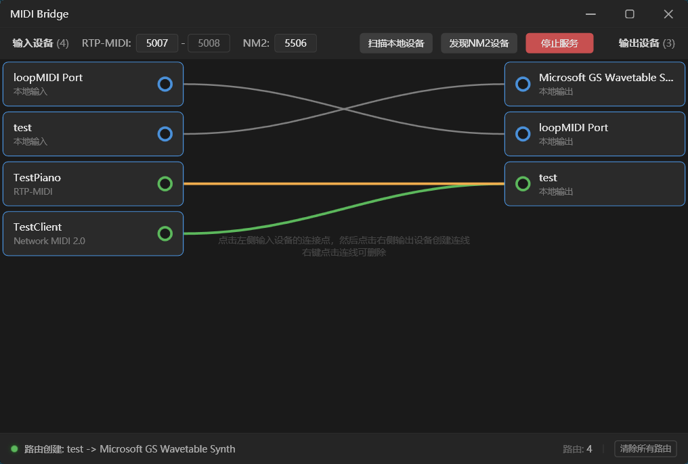

# MidiBridge

一个将 **MIDI 2.0 Network** 和 **RTP-MIDI** 协议的网络 MIDI 设备桥接到本地 MIDI 端口的 Windows 桌面应用程序。

## 主界面



## 功能特性

- **RTP-MIDI 协议支持** - 兼容 Apple Network MIDI 标准
- **Network MIDI 2.0 支持** - 实现最新的 MIDI 2.0 网络协议
- **本地 MIDI 桥接** - 网络设备与本地物理/虚拟 MIDI 端口双向通信
- **自动设备发现** - 通过 mDNS/Bonjour 自动发现网络 MIDI 设备
- **可视化路由管理** - 直观的拖拽式 MIDI 路由配置
- **消息过滤** - 支持 MIDI 消息类型过滤(暂不支持)
- **配置持久化** - 自动保存路由配置和设备状态

## 系统要求

- Windows 10/11
- .NET 8.0 Runtime

## 快速开始

### 安装

1. 从 [Releases](https://github.com/your-repo/MidiBridge/releases) 下载最新版本
2. 解压 `MidiBridge-win-x64.zip`
3. 双击 `MidiBridge.exe` 运行

### 基本使用

1. **设备发现** - 应用启动后会自动扫描网络中的 MIDI 2.0 和 RTP-MIDI 设备
2. **创建路由** - 从左侧设备列表拖拽源设备到右侧目标设备
3. **启用路由** - 勾选路由旁的复选框启用消息转发
4. **自动保存** - 所有配置会自动保存到本地

## 架构与技术

### 系统架构

```
┌─────────────────────────────────────────────────────────────────────┐
│                        MidiBridge Application                       │
├─────────────────────────────────────────────────────────────────────┤
│  UI Layer           │  ViewModel Layer    │  Models Layer           │
│  (MainWindow.xaml)   │  (MainViewModel)    │  (MidiDevice, Route)   │
├─────────────────────────────────────────────────────────────────────┤
│                         Services Layer                              │
├──────────────┬──────────────┬──────────────┬────────────────────────┤
│ MidiDevice   │ MidiRouter   │ ConfigService│ LogService             │
│ Manager      │              │              │ (Serilog)              │
├──────────────┴──────────────┴──────────────┴────────────────────────┤
│  RTP-MIDI Service  │  Network MIDI 2.0  │  mDNS Discovery           │
│  (UDP 5004/5005)   │  (UDP 5506)         │  (224.0.0.251:5353)      │
└─────────────────────────────────────────────────────────────────────┘
                              │
┌─────────────────────────────┴───────────────────────────────────────┐
│  Local MIDI (NAudio)  │  RTP-MIDI Devices  │  Network MIDI 2.0      │
│  Physical/Virtual     │  Apple Network     │  UMP Protocol          │
└─────────────────────────────────────────────────────────────────────┘
```

### 协议支持

| 协议 | 端口 | 说明 |
|------|------|------|
| RTP-MIDI | UDP 5004 (控制) / 5005 (数据) | Apple Network MIDI 标准 |
| Network MIDI 2.0 | UDP 5506 | MIDI 2.0 网络协议，支持 UMP |
| mDNS Discovery | UDP 5353 | 自动发现 `_midi2._udp` 服务 |

### UMP (Universal MIDI Packet)

| 类型 | 大小 | 说明 |
|------|------|------|
| 0x2 | 4 字节 | MIDI 1.0 Channel Voice (32-bit) |
| 0x4 | 8 字节 | MIDI 2.0 Channel Voice (64-bit) |

项目实现了完整的 UMP 与 MIDI 1.0 消息格式转换。

## 项目结构

```
MidiBridge/
├── Models/                     # 数据模型
│   ├── MidiDevice.cs           # MIDI 设备定义
│   ├── MidiRoute.cs            # 路由配置
│   └── AppConfig.cs            # 应用配置
├── ViewModels/                 # MVVM 视图模型
│   ├── MainViewModel.cs        # 主窗口逻辑
│   ├── ViewModelBase.cs        # 基类
│   └── RelayCommand.cs         # 命令实现
├── Services/                   # 核心服务
│   ├── MidiDeviceManager.cs    # 设备管理
│   ├── MidiRouter.cs           # 路由引擎
│   ├── ConfigService.cs        # 配置持久化
│   ├── LogService.cs           # 日志（Serilog）
│   ├── PortChecker.cs          # 端口检测
│   └── NetworkMidi2/
│       ├── NetworkMidi2Service.cs    # MIDI 2.0 服务
│       ├── NetworkMidi2Protocol.cs   # 协议硬件
│       └── MdnsDiscoveryService.cs   # mDNS 发现
├── Converters/                 # UI 值转换器
├── Controls/                   # 自定义控件
└── MainWindow.xaml             # 主界面

## 配置与日志

### 配置文件

配置文件位置: `%LocalAppData%\MidiBridge\config.json`

```json
{
  "Window": {
    "Left": 100,
    "Top": 100,
    "Width": 900,
    "Height": 600,
    "IsMaximized": false
  },
  "Network": {
    "RtpPort": 5004,
    "NM2Port": 5506,
    "AutoStart": false
  },
  "Routes": [
    {
      "SourceId": "local-in-0",
      "TargetId": "nm2-device@192.168.1.5",
      "IsEnabled": true
    }
  ],
  "InputDeviceOrder": ["local-in-0"],
  "OutputDeviceOrder": ["local-out-0"],
  "DisabledDevices": []
}
```

### 日志文件

日志文件位置: `%LocalAppData%\MidiBridge\logs\`

使用 **Serilog** 进行结构化日志记录，支持滚动日志文件。

## 依赖项

| 包 | 版本 | 用途 |
|---|------|------|
| NAudio | 2.3.0 | 本地 MIDI 设备访问 |
| Serilog.Sinks.File | 7.0.0 | 文件日志记录 |

## 开发指南

### 环境要求

- .NET 8.0 SDK
- Visual Studio 2022 或 VS Code
- Windows 10/11

### 构建项目

```bash
# 克隆仓库
git clone https://github.com/your-repo/MidiBridge.git
cd MidiBridge

# 恢复依赖
dotnet restore

# 调试运行
dotnet run --project MidiBridge
```

### 发布版本

```bash
# 构建发行版
dotnet publish MidiBridge/MidiBridge.csproj -c Release -r win-x64 --self-contained

# 输出位置
# MidiBridge/bin/Release/net8.0-windows/win-x64/publish/
```

### 依赖项

| 包 | 版本 | 用途 |
|---|------|------|
| NAudio | 2.3.0 | 本地 MIDI 设备访问 |
| Serilog.Sinks.File | 7.0.0 | 文件日志记录 |

### 测试工具

`Test` 项目包含以下测试工具：

- **本地 MIDI 设备测试** - 列出和监控本地 MIDI 设备
- **RTP-MIDI 服务器模拟** - 模拟 RTP-MIDI 服务，验证客户端连接
- **RTP-MIDI 钢琴** - 键盘→MIDI→RTP-MIDI 转发测试
- **Network MIDI 2.0 客户端** - 完整的 NM2 会话测试
- **端口占用测试** - 验证端口冲突检测
- **多设备发现测试** - 创建多个可发现的 NM2 设备

## 协议详解

### MIDI 消息路由

```
[源设备]                    [路由决策]                    [目标设备]
   │                            │                            │
   ▼                            ▼                            ▼
本地输入 ─────┐                          ┌─────► 本地输出
(RTP设备) ───┼──► MidiRouter ───────────┼─────► (RTP设备)
(网络MIDI2) ─┘   1. 检查路由是否存在      └─────► (网络MIDI2)
                  2. 检查路由是否启用
                  3. 应用消息过滤器
                  4. 分发到所有匹配目标
```

### RTP-MIDI 会话流程

```
远程设备                    MidiBridge
   │                          │
   │──── IN 包 ──────────────►│  (连接请求)
   │◄─── OK 包 ────────────── │  (接受)
   │                          │
   │──── RTP MIDI 数据 ─────► │  (MIDI 消息)
   │◄─── CK 响应 ──────────── │  (同步响应)
   │                          │
   │──── BY 包 ─────────────► │  (断开)
```

### Network MIDI 2.0 命令

| 命令 | 代码 | 说明 |
|------|------|------|
| Invitation | 0x01 | 会话建立请求 |
| EndSession | 0x02 | 会话终止通知 |
| Ping | 0x03 | 心跳保活 |
| UMPData | 0x10 | UMP 数据传输 |

## 许可证

[MIT License](LICENSE.txt)